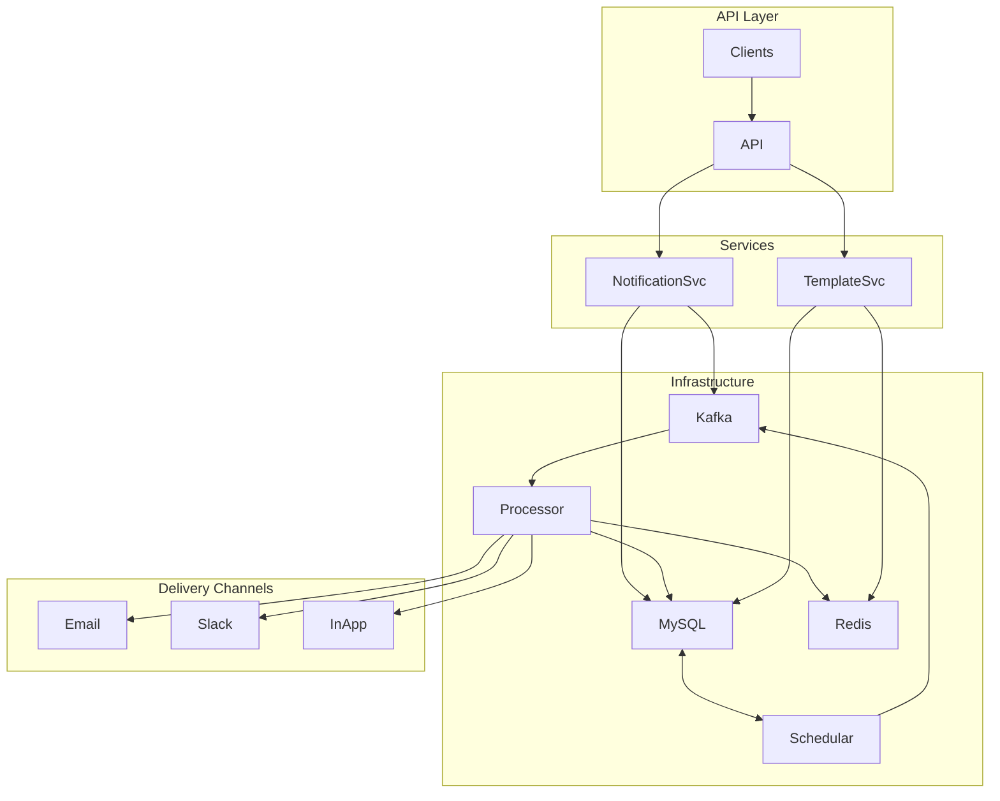
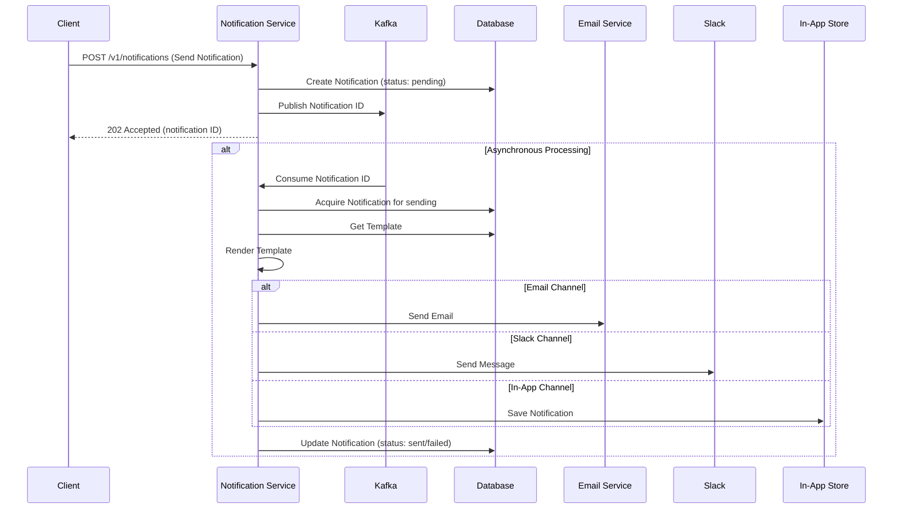

# Notification Service (`notify-srv`)

A robust, scalable, and observable notification service built with Go. It provides a centralized system for managing and sending notifications across multiple channels like Email, Slack, and In-App.

## Flow





## Web UI for End-to-End Testing

This project includes a simple web interface to demonstrate and test the complete end-to-end flow of creating templates and sending notifications.
Access the URL to serve the HTML `http://localhost:8098`

 - **Ensure the service is running** by following the steps above (`docker-compose up -d --build`).
 - **Use the Interface**:
    *   **Create Templates**: Use the form on the left to create new notification templates for different channels.
    *   **Send Notifications**: Once a template is created, it will appear in the dropdown. You can then select it, provide recipient details and a payload, and send a notification immediately or schedule it for later.
    *   **View Notifications**: The right-hand panel shows a list of recent notifications and their statuses, which you can refresh.

## Features

- **Multi-Channel Support**: Easily send notifications via Email, Slack, and In-App channels.
- **Dynamic Templates**: Utilizes Go's templating engine (`text/template`) for dynamic and version-controlled notification content.
- **RESTful API**: A clean and simple API for managing templates and sending notifications. (See `api/openapi.yaml` for the full specification).
- **Asynchronous Processing**: Leverages Kafka for processing notification requests asynchronously, ensuring high throughput and resilience.
- **Database Migrations**: Manages database schema changes cleanly using a dedicated migrator tool.
- **Observability**: Exposes application metrics in Prometheus format for easy monitoring and alerting.
- **Containerized**: Comes with a complete `docker-compose` setup for all dependencies, enabling a one-command local environment startup.

## Tech Stack

- **Language**: Go (v1.24)
- **Framework**: Chi (for routing) & Viper (for configuration)
- **Database**: MySQL 8.4
- **Message Broker**: Kafka
- **Monitoring**: Prometheus & Grafana
- **Local Email Testing**: MailHog
- **Containerization**: Docker & Docker Compose

## Prerequisites

Before you begin, ensure you have the following installed:

- [Go](https://go.dev/doc/install) (version 1.24 or later)
- [Docker](https://docs.docker.com/get-docker/)
- [Docker Compose](https://docs.docker.com/compose/install/)

## Getting Started

Follow these steps to get the notification service running on your local machine.

### 1. Clone the Repository

```bash
git clone https://github.com/ckshitij/notify-srv.git
cd notify-srv
```

### 2. Start Dependencies and Run the Application

You can run the entire stack, including the application and its dependencies, using Docker Compose.

```bash
docker-compose up -d --build
```

This command will:
- Build the `notify-srv` Docker image.
- Start all services defined in `docker-compose.yml` (MySQL, Prometheus, etc.) in detached mode.
- The application will be available on port `8098`.

### 3. Run Database Migrations

Once the database container is healthy, run the database migrations to set up the required tables and seed initial data.

```bash
go run cmd/migrator/main.go
```

### 4. Accessing Services

Once everything is running, you can access the various components:

- **Notification Service API**: `http://localhost:8098/`
- **Web UI for E2E Testing**: Open `static/index.html` in your browser to access a UI for testing the end-to-end flow.
- **Grafana Dashboard**: `http://localhost:3000` (Login: `notif_admin` / `Grafana@123`)
- **MailHog (Email Viewer)**: `http://localhost:8025`
- **Prometheus Targets**: `http://localhost:9090`

## Running Tests

To run the test suite, execute the following command from the project root:

```bash
go test ./...
```

## Project Structure

- `api/`: Contains the OpenAPI specification file.
- `cmd/`: Main application entry points.
  - `app/`: The main notification service server.
  - `migrator/`: The database migration tool.
- `config/`: Contains the application configuration file (`config.yml`).
- `deployments/`: Docker and `docker-compose` files for local development.
- `internal/`: All private application logic.
  - `config/`: Configuration loading logic.
  - `kafka/`: Kafka producer and consumer.
  - `logger/`: Application logger setup.
  - `metrics/`: Prometheus metrics setup.
  - `pkg/`: Core business logic for notifications, templates, and senders.
  - `server/`: HTTP server setup, routing, and middleware.
- `migrations/`: SQL migration files (`.up.sql` and `.down.sql`).
- `static/`: Static assets (if any).

## Core Logic (`internal/pkg`)

The `internal/pkg` directory contains the core business logic for the notification service. It is organized into several sub-packages, each with a distinct responsibility.

### `template`
- **Purpose:** Manages notification templates.
- **Functionality:** Provides CRUD (Create, Read, Update, Delete) operations for templates, which are stored in a MySQL database. It exposes HTTP handlers for managing these templates via an API.

### `notification`
- **Purpose:** Orchestrates the creation, scheduling, and sending of notifications.
- **Functionality:** This is the central service. It receives requests to send notifications, creates a notification record in the database, and publishes the notification ID to a Kafka topic. A Kafka consumer then picks up the message and processes the notification.

### `renderer`
- **Purpose:** Renders notification content from templates.
- **Functionality:** Takes a template and a set of data (variables) and uses Go's `text/template` package to produce the final content for a notification, such as an email body or a Slack message.

### `senders`
- **Purpose:** Handles the actual delivery of notifications to external services.
- **Functionality:** Implements a strategy pattern with a common `Sender` interface. Concrete implementations for different channels are provided:
    - `email`: Sends notifications via an email service.
    - `slack`: Sends notifications to a Slack channel.
    - `inapp`: Stores notifications to be displayed within a UI.

### `schedular`
- **Purpose:** Processes scheduled and stuck notifications.
- **Functionality:** A background worker that periodically queries the database for notifications that are due to be sent or have been stuck in a "sending" state for too long. It then enqueues them for processing by the `notification` service.

### How the Kafka Changes Help the Service

The integration of Kafka into the notification service provides several key benefits:

- **Scalability:** By using Kafka as a message broker, the service can handle a much higher volume of notification requests. The request handling is decoupled from the notification processing, allowing each part to be scaled independently.
- **Reliability:** Kafka's at-least-once delivery guarantee ensures that notifications are not lost even if a worker crashes. The message will be re-processed by another worker, making the delivery more reliable.
- **Resilience:** The use of a message queue makes the service more resilient to failures. If a downstream service (like an email server) is temporarily unavailable, the messages will remain in the Kafka topic and can be processed later when the service is back online.
- **Improved Performance:** By offloading the notification processing to a separate set of workers, the main request-handling part of the service can respond to user requests much faster. This improves the overall performance and user experience.
- **Channel-based Topics:** The service now uses different Kafka topics for different notification channels (e.g., `notifications-email`, `notifications-slack`). This provides better isolation, scalability, and flexibility. You can monitor and scale each channel independently.
